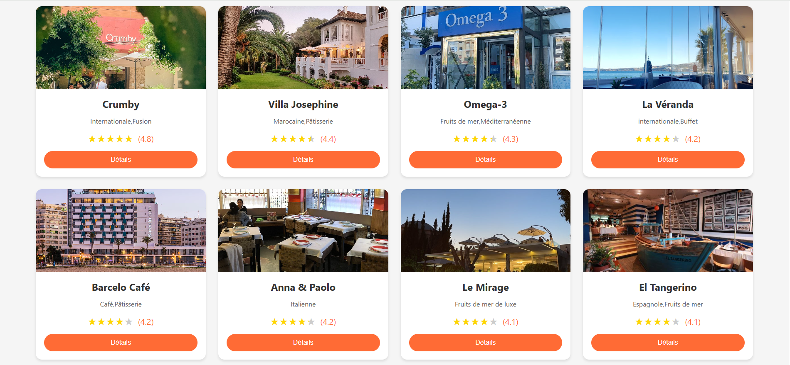
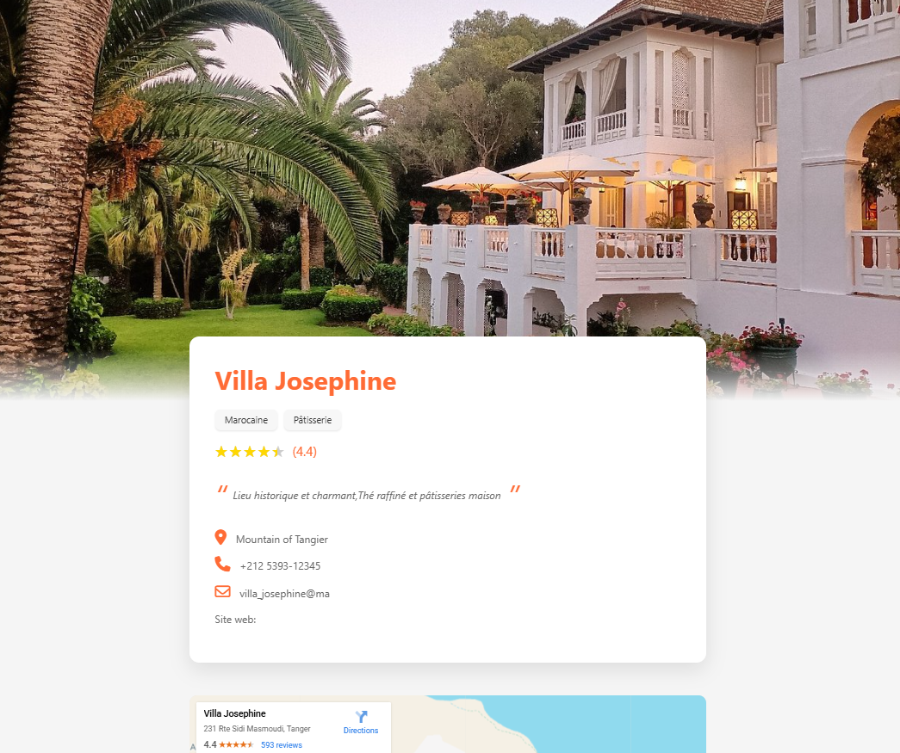
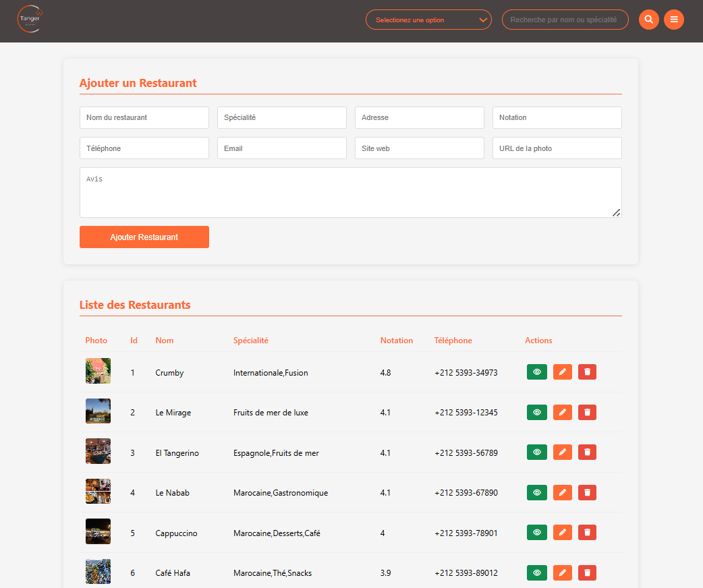

# Blog-de-restaurants-Tanger


Ce projet est une application web intuitive qui vous permet de découvrir les meilleurs restaurants de la ville de Tanger. Grâce à une interface fluide et moderne, explorez une variété d'établissements, consultez leurs détails. L’application est développée avec un mélange de technologies front-end et back-end, garantissant une expérience utilisateur dynamique et réactive. 

## Fonctionnalités

- **Page d'accueil**: affiche l’ensemble des restaurants disponibles via l’API sous forme de cartes présentant leurs informations principales.
- **Page de détails**: permet, après clic sur un restaurant, de consulter toutes ses informations détaillées (adresse, téléphone, e‑mail, site web, note, etc.).
- **Page d’administration**: interface dédiée pour gérer les données des restaurants, offrant les fonctionnalités suivantes :
  - **Ajouter un restaurant**: créer un nouveau restaurant avec son nom, son adresse et tous ses détails.
  - **Modifier un restaurant**: mettre à jour les informations d'un restaurant existant.
  - **Supprimer un restaurant**: retirer un restaurant de la liste.
- **Barre de recherche**: filtre et recherche les restaurants selon leur nom ou leur spécialité, facilitant la navigation dans la liste.

## Capture d'écran

### Liste des restaurants


### Page de détails


### Page Admin


## Technologies utilisées
- **Frontend**:
  - HTML
  - CSS
  - JavaScript
- **Backend**:
  - Node.js
  - JSON for data storage
  - API REST pour la communication avec le frontend

## Structure du projet
```
Blog-de-restaurants-Tanger
├── backend
│   ├── data.json
│   ├── node_modules
│   ├── package-lock.json
│   ├── package.json
│   └── server.js
├── frontend
│   ├── css
│   │   ├── admin.css
│   │   └── restaurant.css
│   │   └── style.css
│   ├── images
│   │   ├── logo.png
│   │   ├── hero.png
│   │   ├── footer.png
│   ├── js
│   │   ├── admin.js
│   │   ├── Restaurant.js
│   │   └── script.js
│   ├── admin.html
│   ├── index.html
│   └── restaurant.html
└── README.md
```

## Instructions d’installation

1. **Cloner le dépôt GitHub**:
   ```bash
   git clone https://github.com/Fatima-Zohra-Jaber/Blog-de-restaurants-Tanger.git
   ```

2. **Se rendre dans le répertoire du projet**:
   ```bash
   cd Blog-de-restaurants-Tanger
   ```

3. **Installer les dépendances**:
   Placez-vous dans le dossier `backend` et exécutez:
   ```bash
   npm install
   ```

4. **Démarrer le serveur**:
   ```bash
   node server.js
   ```

5. **Lancer l’application**:
    Ouvrez `index.html` dans votre navigateur pour explorer le frontend.
    

## Améliorations futures
- Ajouter une base de données pour un stockage de données plus évolutif.
- Mettre en œuvre l’authentification des utilisateurs.
- Enrichir le panneau d’administration avec des fonctionnalités avancées.
- Optimiser l’interface pour les appareils mobiles.


